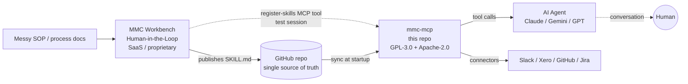
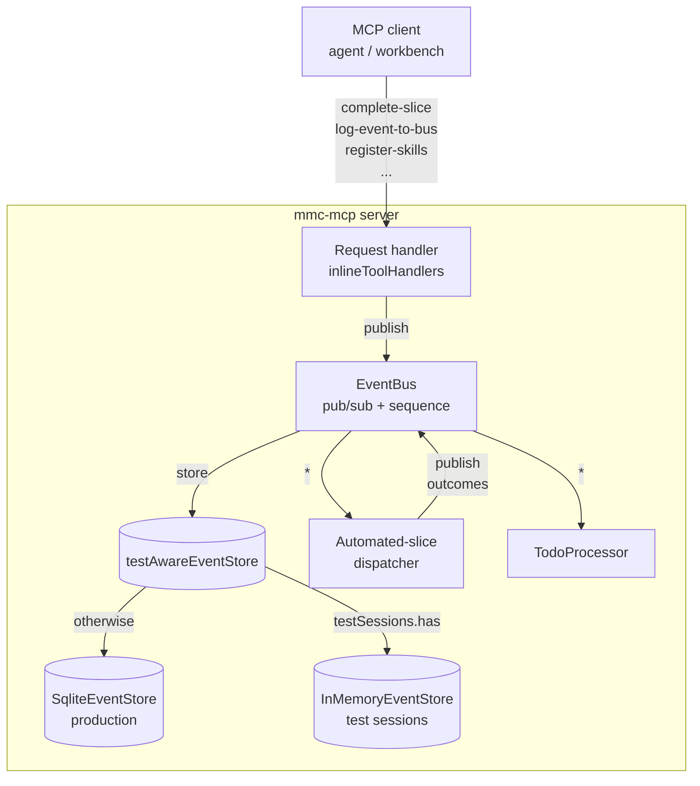
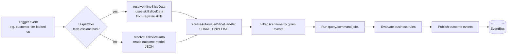
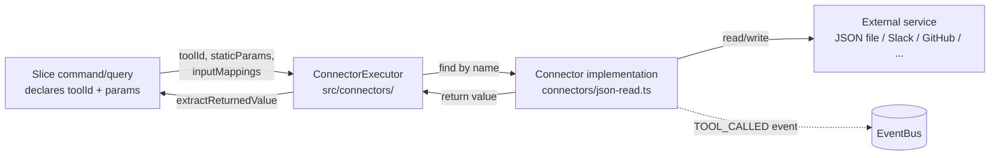
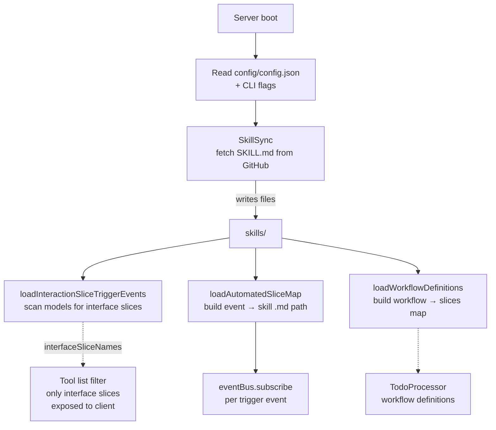

# Architecture

This doc covers the runtime in enough detail to debug a stuck workflow, author a new connector, or reason about whether a proposed change will hold up under load. For a high-level introduction (what `mmc-mcp` is and why it exists), see [`README.md`](../README.md). For licensing, see [`LICENSING.md`](../LICENSING.md).

## The two halves: authoring and execution

`mmc-mcp` is the executor. The authoring story lives in **[MMC Workbench](https://modelmycontext.com)** — a separate human-in-the-loop tool that turns messy SOPs into structured outcome models, generates `SKILL.md` files, and either commits them to GitHub (for production) or pushes them in-memory to a running `mmc-mcp` (for test sessions).



Two flows reach the server:

1. **Production sync** — `mmc-mcp` reads `SKILL.md` files from one or more GitHub repos at startup (configured in `config/config.json`), and from the local `skills/` directory.
2. **Workbench test sessions** — the workbench connects via MCP and pushes skills directly via the `register-skills` tool. Events for these sessions are isolated (in-memory event store, no todos) so authors can validate a process end-to-end before publishing.

## Inside the server

The server boots with **two MCP transports active simultaneously**:

- **HTTP** (Hono + `@hono/mcp` StreamableHTTP) on `:3001/mcp` — for Claude Desktop, MCP Inspector, the workbench, and any HTTP-MCP client.
- **stdio** — for direct CLI integration.

Both transports register the same tool handlers via `registerHandlers()` in `src/server/index.ts`.

### Event bus is the source of truth

Every state change in a workflow is an event. Events are sequenced (monotonic counter), persisted to SQLite (`data/events.db` for production sessions; `InMemoryEventStore` for test sessions), and routed via a `*` subscriber that is the **single dispatch point** for automated slices.



The dispatcher sits at `src/server/index.ts` inside `eventBus.subscribe('*', ...)`. It:

1. **Routes test sessions to session skills first**, with no fallthrough to disk. Disk slices may be stale snapshots of a different model, so falling through would silently corrupt a test run.
2. **Routes production events to disk-based slices** via `automatedSliceMap` (a `Map<eventType, skillMdPath[]>` built at startup).

### Two paths, one handler

This is the single most important architectural rule in the codebase. Production and workbench test sessions both run through the same `createAutomatedSliceHandler` in `src/services/automatedSliceRunner.ts`. The only thing that differs is **how `SliceData` is resolved**:

- `resolveDiskSliceData(skillMdPath)` — production. Reads the outcome model JSON via the cached loader.
- `resolveInlineSliceData(sliceData, name)` — test session. Wraps in-memory sliceData pushed by `register-skills` and synthesises `factIdToName` from the slice's own facts.



Same shape applies to `complete-slice`: a `resolveSliceForCompletion(sliceId, cid)` checks session skills first, falls back to disk; the rest of the pipeline (`executeSliceQueries` → `evaluateSlice` → `completeSliceFinalize`) is uniform.

**If you find yourself wanting to add path-specific behaviour to a handler body — STOP.** Push the difference into the resolver or the dispatcher, never into the shared pipeline. The block comment at the top of `src/services/automatedSliceRunner.ts` says this in code; the rule is enforced in code review.

What stays divergent **on purpose**:

| Concern | Production | Test session | Lives in |
|---|---|---|---|
| Routing policy | `automatedSliceMap` lookup | `sessionSkills` lookup, no disk fallthrough | dispatcher |
| Event persistence | SQLite | InMemoryEventStore | `testAwareEventStore` |
| Todo creation | Yes, per workflow definition | No | `TodoProcessor` (skips test sessions) |
| Action-slice fresh session | Reuses `providedSessionId` | Mints a fresh UUID to defeat hallucinated session IDs | `complete-slice` resolver |

### Slice anatomy

A slice is one entry of `model.slices[]` in the outcome model JSON. Two flavours:

- **Interface slices** (have an `interface` block) — executed by an AI agent. The agent polls `get-next-event`, receives the event, dispatches to the slice's `.md` body for instructions, collects user input, calls `complete-slice` with the collected facts.
- **Automated slices** (have `triggers_on_event` in frontmatter, no `interface`) — executed server-side by `createAutomatedSliceHandler` when the trigger event fires.

A slice declares:

- `scenarios[]` — each with `given[]` events that must be present, `givenBusinessRules[]` and `whenBusinessRules[]` that evaluate against current facts, and `then[]` outcomes to publish if the rules match.
- `queries[]` — read jobs (typically `json-read` connector calls) that run before scenario evaluation. Their `returnedFact` ends up in the fact map.
- `command` — a single write job, an LLM instruction, or a passthrough. Runs before scenario evaluation.
- `outcomes[]` — slice-level outcomes used in the no-scenarios pass-through case.
- `facts[]` — fact declarations referenced by `factId`.

### Connector layer

Connectors are the bridge between slice declarations and external services. Built-in connectors live in [`/connectors/`](../connectors/) (Apache-2.0); the executor that runs them lives in `src/connectors/connectorExecutor.ts` (GPL-3.0).



The SDK at `sdk/` defines the public `Connector` interface and the parsing helpers connector authors need. **Connectors must not import from `@src/...`** — see [`sdk/README.md`](../sdk/README.md) for the boundary rule and [`LICENSING.md`](../LICENSING.md) for why.

External MCP servers (declared in `config/config.json` under `externalServers`) are spawned and managed by `ExternalMcpManager`. Their tools are merged into the same tool map that built-in connectors register into, so a slice declaration just specifies a `toolId` without caring whether it's local or proxied.

### Request handler dispatch

`src/server/index.ts` registers a single `CallToolRequestSchema` handler that dispatches in this order:

1. **Gate** — reject tools not in the listed tool definitions.
2. **`inlineToolHandlers` dispatch table** — 12 named handlers for built-in tools (`describe-data-sources`, `register-agent`, `register-skills`, `log-event-to-bus`, `get-next-event`, `list-todos`, `get-session-events`, `claim-todo`, `resolve-todo`, `unclaim-todo`, `complete-slice`, `get-github-methods`).
3. **Connector check** — if `name` matches a registered `Connector`, run its `execute()` via `ConnectorExecutor`.
4. **External tool delegation** — proxy to a registered external MCP server's tool.
5. **Session skill resolution** — if `name` is a workbench-registered slice, return its markdown body.
6. **Disk skill resolution** — if `name` is a `.md` file under `skills/`, return its body. This path also runs server-side prefetch queries declared on the slice and appends their results to the body.

Adding a new built-in tool means adding an entry to the `inlineToolHandlers` dispatch table, not bringing back the old `if (name === "X")` cascade.

## Data layer

Three storage facets:

| Use case | Implementation | Location |
|---|---|---|
| Event log (production) | `SqliteEventStore` | `data/events.db` |
| Event log (test sessions) | `InMemoryEventStore` | RAM, discarded on disconnect |
| JSON collections (read by `json-read`) | `JsonDataSource` | `data/<collection>.json` |
| SQLite key-value collections | `SqliteDataSource` | `data/data.db` |
| Todo records | `TodoStore` | `data/events.db` (separate table) |
| Skill `.md` source files | filesystem | `skills/<workflow>/<slice>/<slice>.md` |

`testAwareEventStore` is a thin router that picks `InMemoryEventStore` or `SqliteEventStore` per event based on whether `event.sessionId` is in the `testSessions` set. This is how production and test traffic share the bus without contaminating each other's persistent state.

## Skill loading



Pass `--no-sync` on startup to skip the GitHub fetch (useful when developing offline or against locally-edited `SKILL.md` files). Pass `--force-sync` to clear the SHA cache and refetch everything.

The cache (`skills/.sync-state.json`) is gitignored. It tracks per-file SHAs so subsequent boots only refetch changed files — see `src/skill-engine/skillSync.ts`.

## Testing

The test suite (~347 tests, 17 files) runs as **Vitest under Bun**. Production uses `bun:sqlite`, but Vitest spawns Node-like workers that can't resolve `bun:` imports, so we alias `bun:sqlite` → a `node:sqlite`-backed shim:

- `tests/_shims/bun-sqlite.ts` — the shim itself.
- `vitest.config.ts` — declares the alias.

Hot paths are guarded by `tests/performance.test.ts`, which exercises EventBus throughput, SqliteEventStore I/O, and BusinessRuleEvaluator with wall-clock thresholds. Run after every `pnpm build`:

```bash
pnpm build && bun x vitest run tests/performance.test.ts
```

A failure means a change made something measurably slower. **Don't raise the threshold** unless the slower behaviour is intentional and justified.

## Reading guide

If you're new to the codebase and want a tour:

1. **Start with [`src/server/index.ts`](../src/server/index.ts)** — top to bottom. It sets up the connection pool, event bus, transports, dispatcher, and the inline tool handler table.
2. **Then [`src/services/automatedSliceRunner.ts`](../src/services/automatedSliceRunner.ts)** — read the block comment at the top first; it explains the path unification rule that's load-bearing for the rest.
3. **Then [`src/services/sliceEvaluator.ts`](../src/services/sliceEvaluator.ts)** — `executeSliceQueries` and `evaluateSlice`, the deterministic engine used by `complete-slice`.
4. **Then [`src/skill-engine/interaction-slice-trigger-events.ts`](../src/skill-engine/interaction-slice-trigger-events.ts)** — outcome-model loading, with `extract*` helpers shared between disk and inline sources.
5. **Then [`sdk/connectorTypes.ts`](../sdk/connectorTypes.ts) + a built-in connector** like [`/connectors/json-read.ts`](../connectors/json-read.ts) — the connector contract and a worked example.
6. **Glance at [`tests/services/automatedSliceRunner.test.ts`](../tests/services/automatedSliceRunner.test.ts)** — illustrates how the handler is exercised with plain `SliceData` instead of mocking the loader module.

That's enough to have an accurate mental model. The rest is detail.
