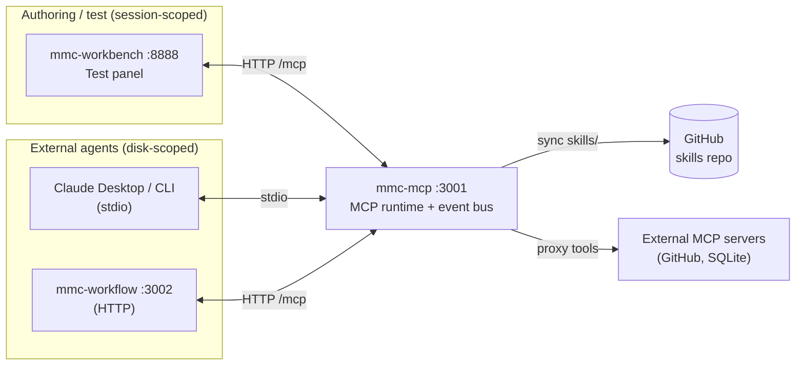
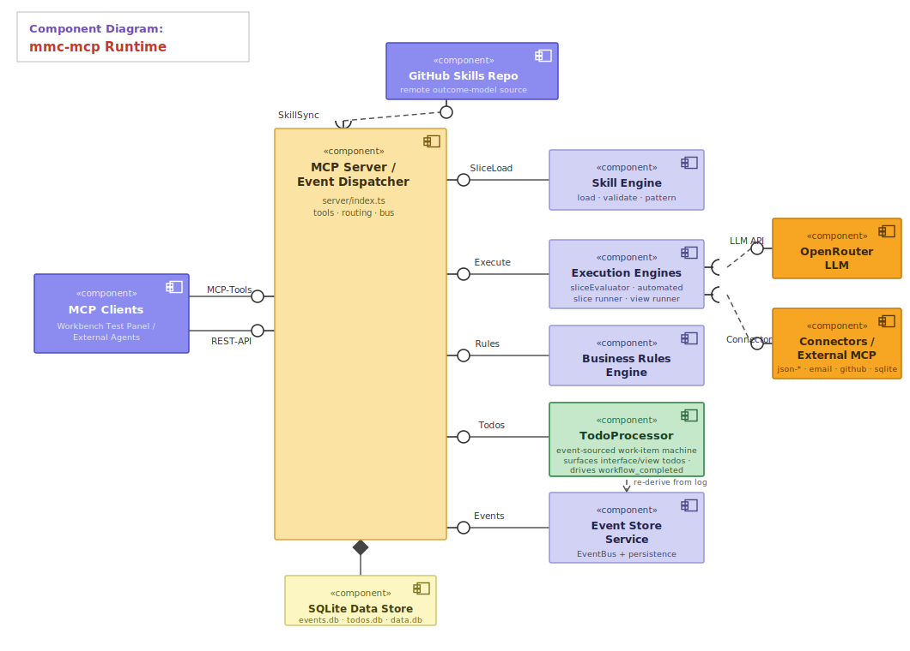
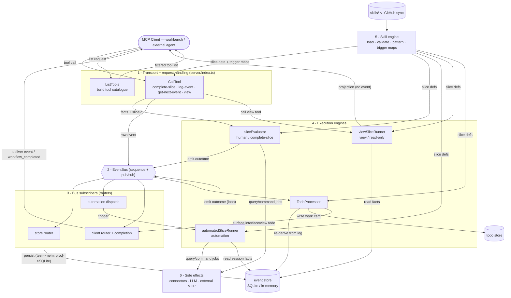
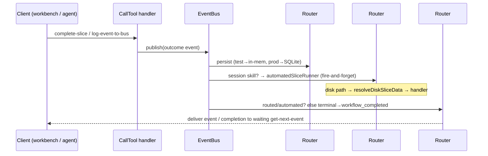

# mmc-mcp — Architecture Analysis

> Deep structural analysis of the mmc-mcp runtime: a complete component map, the
> runtime data-flow, and a prioritized inventory of **knowledge bleeding**
> (leaky coupling) and **code bloat**. Written against the tree at commit
> `ef350fa`. Line references are stable as of that commit.

---

## 1. What mmc-mcp is

An **MCP server** that turns authored *business processes* ("outcome models" made
of *slices*) into Model Context Protocol tools, and sequences each step on an
event bus. It serves two callers from one codebase:

- **mmc-workbench** (authoring UI, port 8888) — drives the runtime through the
  session-scoped **Test panel** (`register-agent` → `register-skills` → poll).
- **External MCP clients** (Claude Desktop, mmc-workflow at 3002) — drive the
  disk-scoped path, reading slices synced from GitHub into `skills/`.

---

## 2. Component map

### Static structure (UML component diagram)

Components with provided/required interfaces, assembly connectors, a composition
diamond to the data store, and a dashed `«use»` dependency on the GitHub skill
source. The **TodoProcessor** is a first-class component — the event-sourced
work-item machine that surfaces interface/view todos and drives
`workflow_completed`.

### Information flow (dynamic view)

Block diagram of how data moves through the runtime. Arrows are labelled with
*what* flows (tool calls, slice data, facts, events, outcomes, todos). Note the
**feedback loop**: an emitted outcome re-enters the bus and can trigger further
automation — the defining shape of this event-driven engine. (For per-module LOC
and the bloat hot-spots, see §4.)

### Responsibility table

| Layer | Module(s) | Responsibility |
|---|---|---|
| **Transport / entry** | `server/index.ts` | Dual transport (HTTP + stdio), MCP handlers, REST API, 3 event routers, composition root, bootstrap, HMR |
| **Skill engine** | `skill-engine/interaction-slice-trigger-events.ts`, `skillSync*` | Load outcome-model JSON, detect pattern, validate, compute trigger/terminal events, fact scoping; GitHub sync |
| **Execution** | `services/automatedSliceRunner.ts`, `sliceEvaluator.ts`, `viewSliceRunner.ts` | Run a slice: scenario gating, query/command jobs, rule eval, outcome publishing |
| **Work surfacing** | `services/todoProcessor.ts`, `todoStore.ts` | Event-sourced creation of interface/view todos |
| **Supporting** | `services/llm.ts`, `utils/businessRuleEvaluator.ts`, `connectors/*`, `src/connectors/*`, `server/externalMcpManager.ts` | LLM calls, rule primitive, connector exec, external MCP proxy |
| **Persistence** | `events/*`, `data-sources/*` | Event bus + store hierarchy, todo store, JSON/SQLite data |

### Runtime dispatch — the three `subscribe('*')` routers

---

## 3. Knowledge bleeding (leaky coupling)

These are the places where one component's knowledge has leaked into others, so a
single conceptual change must be made in several places to stay correct. Ranked
by blast radius.

### B1 — No canonical domain type; the slice/fact model is redeclared everywhere
The core domain objects (`Fact`, `Outcome`, `Scenario`, `SliceData`) have **no
single definition**. They are re-declared as partial structural copies:
- `sliceEvaluator.ts:62-107` — local `Fact/Outcome/Scenario/SliceData`, commented
  *"Types mirroring the workbench's ExternalSliceModel"*.
- `automatedSliceRunner.ts:51` — its own exported `SliceData`.
- Most other consumers take `slice: any`.

The shape is owned by **mmc-workbench's `ExternalSliceModel`**, mirrored by hand
into mmc-mcp, then re-mirrored per-module inside mmc-mcp. The published `sdk/`
boundary defines connector types but **not** the slice/outcome model.
**Fix:** promote a single `OutcomeModel`/`Slice`/`Scenario`/`Fact` type set into
`sdk/` (or a shared `@mmc/model` package) and delete the local copies.

### B2 — Two execution engines implement the same Event-Modeling semantics
`automatedSliceRunner.createAutomatedSliceHandler` (automation path) and
`sliceEvaluator.evaluateSlice`/`executeSliceQueries` (complete-slice path) each
implement: scenario filtering by `given`, query-job execution, command-job
execution, `given`/`when` rule evaluation, and outcome-payload building. Only the
leaf `evaluateBusinessRules` primitive is shared. Both `CLAUDE.md` and
`architecture/slice-patterns.md` explicitly instruct maintainers to *"keep them
aligned"* by hand — which is the defining symptom of duplicated knowledge.
Fact-enrichment is itself duplicated: `spreadObjectFields` (`sliceEvaluator.ts:34`)
vs `applyJobResultToFacts`/`ingestScopedFacts` (`automatedSliceRunner.ts:112,144`).
**Fix:** extract one `SliceExecutor` with the pipeline as composable steps; the
two paths differ only in *trigger* (push vs pull) and *fact seeding*, not in
semantics.

### B3 — Canonical validation is hand-ported across repos
`validateSlice` + `getSlicePattern` + the `SliceValidationCode` set live in
`interaction-slice-trigger-events.ts:131,149,194` and are described in the
knowledge base as a *"verbatim port"* into `mmc-workbench/src/lib/slice-validation.ts`,
kept *"in lock-step manually"*, with a third copy in the workbench synthesis
validator. Three enforcement points, one rulebook, zero shared code — *"drift
between them is a bug"* by the project's own admission.
**Fix:** the same shared package as B1 should export `validateSlice`.

### B4 — "Session-scoped" detection is reinvented inline
The predicate `testSessions.has(sid) || sessionSkills.has(sid)` is duplicated at
`index.ts:196`, `:2790`, `:2878`, `:2912`, each with its own multi-line comment
re-explaining the HMR rationale. It is the de-facto "is this a test session"
function but is never named as one.
**Fix:** one `isSessionScoped(sessionId)` helper on the session-state module.

### B5 — The canonical `getSlicePattern` helper is bypassed
`slice-patterns.md` states *every* consumer must route pattern detection through
`getSlicePattern`. Router #3 instead inlines `skill.sliceData?.automation`
(`index.ts:2884`) to decide interface-vs-automation. This is exactly the inline
check the helper exists to replace, and it will misclassify any future shape
change.

### B6 — `Command` vs `Automation` naming has collapsed into aliases
`extractSliceCommandInstruction = extractSliceAutomationInstruction` and
`loadSliceCommandInstruction = loadSliceAutomationInstruction`
(`interaction-slice-trigger-events.ts:1221,1237`). The slice spec treats Command
and Automation as distinct concepts; the code has quietly merged them, leaving
two names for one function and ambiguity about which concept a caller means.

### B7 — Demo/domain logic compiled into the generic runtime
`connectors/index.ts` registers demo-specific connectors —
`credit-bureau-pull`, `adverse-action-notify`, `loan-application-fetch`,
`budget-top`, `calculate-age` — into the same array as the generic core
(`json-read/write`, `file-store`, `send-email`). An open-source runtime ships a
particular customer's credit-decisioning demo as built-in capability.
**Fix:** split `connectors/core/*` (generic, shipped) from `connectors/examples/*`
(demo, opt-in), or load demo connectors as external connectors.

### B8 — Comments that contradict the code
`sliceEvaluator.ts:9-11` claims it is *"Kept separate … so test-panel logic
doesn't bleed into the main codebase"*, but `CLAUDE.md` documents that **both**
disk and session `complete-slice` flow through it. A maintainer reading the file
header is actively misled about its blast radius. (Also: `data-sources` doc-comment
and B6 aliases.)

### B9 — Identity comparison style is inconsistent at boundaries
Memory/spec mandate **strict `sliceId === ` with no normalization** at routing
boundaries, yet router #3 compares `toKebabCase(skill.publishes) === event.type`
(`index.ts:2916`) and the completion fallbacks rely on kebab equality. Mixing
opaque-id identity with name-normalized identity in the same router is where the
loose-routing class of bugs lives.

---

## 4. Code bloat

| Symptom | Location | Size | Note |
|---|---|---|---|
| **God module** | `server/index.ts` | **3045 LOC** | composition root + 5 MCP handlers + 9 REST routes + 3 event routers + bootstrap + HMR + stdout guard |
| **God function** `registerHandlers` | `index.ts:697-1880` | ~1180 LOC | ListTools handler alone is ~780 LOC (`:709-1492`) |
| **God function** `main` | `index.ts:1937-3004` | ~1067 LOC | bootstrap + all HTTP routes + 2 of the 3 routers inline |
| **God closure** `createAutomatedSliceHandler` | `automatedSliceRunner.ts:423-1018` | ~595 LOC | entire Step 1→4 pipeline in one closure |
| **Misnamed grab-bag** | `interaction-slice-trigger-events.ts` | **1320 LOC** | name says "trigger events" but holds pattern detection + validation + workflow loading + fact scoping + component extraction |
| **Parallel engine** | `sliceEvaluator.ts` | 855 LOC | see B2 — duplicates `automatedSliceRunner` semantics |
| **Dead code** | `events/jsonEventStore.ts` | 143 LOC | imported by nothing in `src/` (only its own test); superseded by Sqlite/InMemory/TestAware |

Four files — `index.ts`, `interaction-slice-trigger-events.ts`,
`automatedSliceRunner.ts`, `sliceEvaluator.ts` — are **~61% of all `src/` TypeScript**
(6238 of ~10,214 LOC). The complexity is concentrated in exactly the files that
are hardest to test: there is **no unit test for `server/index.ts`** (only
`handleLatestEvent.test.ts` covers a helper it calls), because everything is wired
at module scope and cannot be instantiated in isolation. Bloat and untestability
are the same problem here.

---

## 5. Recommended refactor roadmap (highest-quality target)

Ordered so each step de-risks the next. None changes runtime behaviour.

1. **Carve a `model` package (fixes B1, B3, B6).** One source of truth for
   `Slice/Scenario/Outcome/Fact` types + `validateSlice` + `getSlicePattern` +
   validation codes, consumed by mmc-mcp *and* mmc-workbench. Deletes 3 hand-kept
   copies and all per-module type redeclarations.
2. **Split `server/index.ts` (fixes the god module).** Extract: `composition.ts`
   (singleton wiring), `httpRoutes.ts` (the REST API), `mcpHandlers.ts` (ListTools/
   CallTool), `routers/` (the three subscribers as named units), `session.ts`
   (connectionPool + `isSessionScoped`, fixing B4/B5/B9). Target <300 LOC per file
   and make the routers unit-testable.
3. **Unify the execution engines (fixes B2).** One `SliceExecutor` with the
   pipeline as steps; push/pull/view become thin adapters that seed facts and
   choose the trigger. Retire the "keep aligned by hand" instructions.
4. **Quarantine demo connectors (fixes B7).** `connectors/core` vs
   `connectors/examples`; ship only core by default.
5. **Delete `jsonEventStore.ts`** and its test, or document why it stays.
6. **Reconcile docs with code** — refresh the misleading headers (B8) once the
   modules above are split, so each file's comment matches its real blast radius.

Each step is independently shippable and individually reduces the manual
"keep-in-sync" burden the codebase currently depends on.
